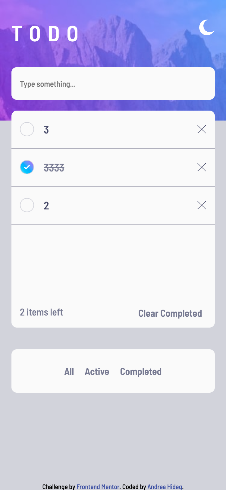

# Frontend Mentor - Todo app solution

This is a solution to the [Todo app challenge on Frontend Mentor](https://www.frontendmentor.io/challenges/todo-app-Su1_KokOW). Frontend Mentor challenges help you improve your coding skills by building realistic projects. 

## Table of contents

- [Overview](#overview)
  - [The challenge](#the-challenge)
  - [Screenshot](#screenshot)
  - [Links](#links)
- [My process](#my-process)
  - [Built with](#built-with)
  - [What I learned](#what-i-learned)
  - [Continued development](#continued-development)
  - [Useful resources](#useful-resources)
- [Author](#author)
- [Acknowledgments](#acknowledgments)

## Overview

### The challenge

Users should be able to:

- View the optimal layout for the app depending on their device's screen size
- See hover states for all interactive elements on the page
- Add new todos to the list
- Mark todos as complete
- Delete todos from the list
- Filter by all/active/complete todos
- Clear all completed todos
- Toggle light and dark mode
- **Bonus**: Drag and drop to reorder items on the list

### Screenshot




### Links

- Solution URL: [Add solution URL here](https://your-solution-url.com)
- Live Site URL: [Add live site URL here](https://your-live-site-url.com)

## My process

### Built with

- Semantic HTML5 markup
- CSS3
- Vanilla JS
- Flexbox
- Mobile-first workflow


### What I learned

I learned some new things on this project.

- using HTML drag and drop API

- saving data in the localStorage. When we reload or close the browser then the data from the todo list and as well the order or the list items remains the same. 

```js
function saveData() {
    localStorage.setItem('data', taskItemsContainer.innerHTML);
}

function showTasks() {
    taskItemsContainer.innerHTML = localStorage.getItem('data')
}
showTasks()
```

- filtering the list (all, active, completed)

- keypress event

```js
//executes the function when we hit enter and adds tasks to the list
inputField.addEventListener('keypress', function (e) {
    if (e.code === "Enter") {
        addTask()
        countTasks() //not needed
    }
});
```
### Continued development
- JS skills
- CSS responsive layouts

### Useful resources

- [HTML drag and drop API](https://developer.mozilla.org/en-US/docs/Web/API/HTML_Drag_and_Drop_API)
- [HTML drag and drop API detailed practical guide](https://web.dev/drag-and-drop/) - This resource provides an excellent practical explanation on this topic. I have built these steps into my code.

- [Using the webstorage API](https://developer.mozilla.org/en-US/docs/Web/API/Web_Storage_API/Using_the_Web_Storage_API)

- [the keypress event](https://developer.mozilla.org/en-US/docs/Web/API/Element/keypress_event) 
- [event.code](https://developer.mozilla.org/en-US/docs/Web/API/KeyboardEvent/code)
- [keyboard events](https://developer.mozilla.org/en-US/docs/Web/API/KeyboardEvent) - These 3 MDN resources helped me with keyboard events and create a simple function which will be executed when we hit enter. It was needed to the input field.
- [gradient generator](https://cssgradient.io)


## Author

- Frontend Mentor - [@MirrMurr](https://www.frontendmentor.io/profile/MirrMurr)


## Acknowledgments
I am really glad that I have found this article on HTML drag and drop API: (https://web.dev/drag-and-drop/). This practical example was a great help to understand the basics of drag and drop API. 

